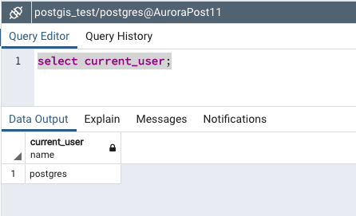
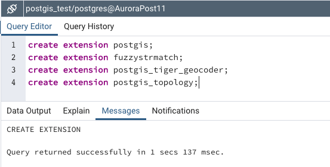
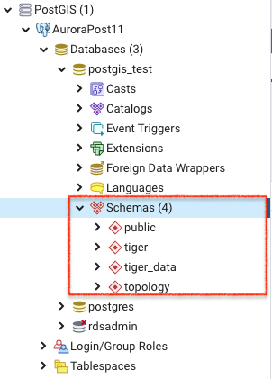
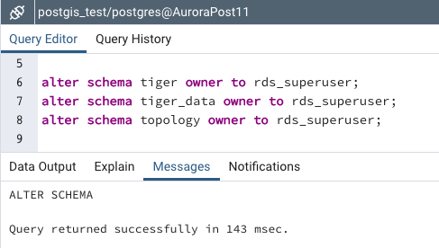
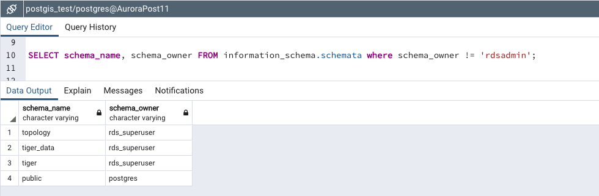

# AWS RDS Aurora PostgreSQL 호환버전에서 PostGIS 활성화하기

## 1. 개요

PostGIS는 지리정보 데이터타입인 geometry를 지원하는 PostgreSQL의 확장모듈이다. SQL에서 위치 쿼리를 실행할 수 있도록 해주며 위치 및 맵핑 정보를 저장하고 쿼리 할 수 있는 공간개체와 함수를 제공한다.

## 2. 여기서 사용하는 서비스

<hr/>
2-1. Infra

- Amazon Web Service
- RDS Aurora

2-2. Software

- PostgreSQL 11
- PGAdmin 4

## 3. 실습 요약

<hr/>

1. DB의 마스터 유저로 접속
2. PostGIS 확장 모듈 로드하기
3. 확장 모듈 및 객체 소유권 이전하기
4. 확장 모듈 테스트

## 4. How-to

<hr/>

### 4-1. DB의 마스터 유저로 접속

[PGAdmin 4](https://www.pgadmin.org/download/)는 PostgreSQL 오픈소스 진영에서 무료로 제공하는 데이터베이스 접속 툴입니다. 모든 데이터베이스 작업을 GUI로 작업 할 수 있도록 해 주어 psql보다 쉽게 사용 할 수 있습니다.

RDS 인스턴스를 생성 할 때 지정했던 수퍼유저로 접속합니다. 해당유저는 rds_superuser 역할에 자동으로 할당되며, 이는 나머지 실습 단계를 수행하는데 필요한 권한입니다.
아래는 현재 접속 된 유저 정보를 확인 한 스크린샷입니다.



### 4-2. PostGIS 확장 모듈 로드하기

CREATE EXTENSION 문을 사용하여 PostGIS 확장 모듈을 로드합니다.

```
 create extension postgis;
 create extension fuzzystrmatch;
 create extension postgis_tiger_geocoder;
 create extension postgis_topology;
```



그런 다음 왼쪽 브라우저 네비게이션을 보면 스키마 탭 하위에 해당 스키마가 생성 된 것을 확인 할 수 있습니다.



### 4-3. 확장 모듈 및 개체 소유권 이전하기
확장모듈을 모두 로드했다면, 이 확장모듈의 소유권을 postgres가 아닌 rds_superuser에게 이관해야합니다. 아래 쿼리문을 수행하세요
```
alter schema tiger owner to rds_superuser;
alter schema tiger_data owner to rds_superuser;
alter schema topology owner to rds_superuser;
```


적용이 완료 되었는지 아래 쿼리문으로 확인 해 봅니다
```
SELECT schema_name, schema_owner FROM information_schema.schemata where schema_owner != 'rdsadmin';
```
아래 스크린샷 처럼 세 개의 스키마가 모두 소유자가 rds_superuser 로 변경되었습니다.
