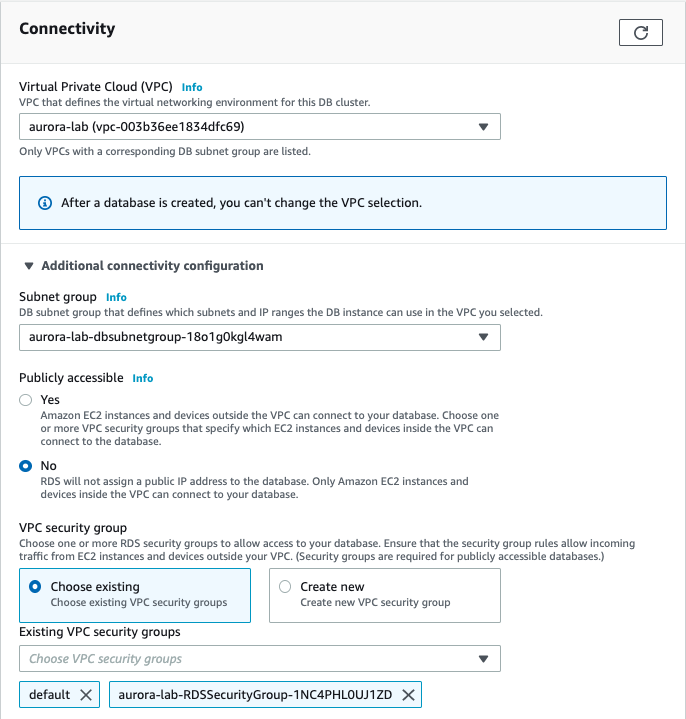

# Lab01. Aurora 인스턴스 생성 & 접속하기

## 1. 개요

Amazon RDS는 관계형 데이터베이스를 빠르게 프로비저닝 하여 사용자로 하여금 인프라에 신경쓰지 않고 데이터베이스 작업에만 집중 할 수 있도록 도와주는 관리형 서비스이다. 또한 주요 DBA 업무를 웹콘솔에서 손쉽게 설정 및 자동화하여 대규모의 인프라 환경에서 데이터베이스 관리의 부담을 줄여줄 수 있다.

## 2. 여기서 사용하는 서비스

2-1. Infra

- Amazon Web Service
- AWS CloudFormation
- RDS Aurora

2-2. Software

- MySQL 5.7
- Workbench
- Putty 및 Terminal application

## 3. 목표 아키텍쳐


## 4. 실습 요약

1. CloudFormation 을 이용해 실습환경 셋팅하기
2. RDS 인스턴스 생성하기
3. 데이터베이스에 접속 해 보기
4. 쿼리 수행하기

## 5. How to

### 5-1. 실습 환경 셋팅하기

**<span style="color:red"> < 이 워크샵은 서울리전 (ap-northeast-2) 에서 진행됩니다.></span>**

현재 접속 중인 웹 콘솔의 리전이 서울로 선택되어있는지 확인하세요

① [EC2] > [Key pairs] > [Create keypairs] 클릭

- Key pair name : aurora-lab-key 입력

  

- [Create] 클릭 하고 다운로드 되는 pem파일을 저장 해 둡니다.

② [CloudFormation] > [Stack] > [Create stack] 을 클릭하여 스택 생성을 시작합니다.
③ Specify template 화면에서

- 아래 CloudFormation 템플릿을 다운로드 받아 업로드 합니다.

  [Lab01.env-template.json](https://github.com/louise-blackolive/sookim-portfolio/blob/master/blog/AWS/RDS/attachment/Lab01.env-template.json)

  

④ Specify stack details 화면에서

- Stack name : aurora-lab 입력
- KeyName : aurora-lab-key 선택

  

- 나머지는 그대로 두고 [Next] 클릭
  ⑤ [Create stack] 을 클릭하여 스택 생성을 완료합니다.

  

### 5-2. RDS 인스턴스 생성하기

① [RDS] > [Database] > [Create database] 클릭
② Create Database 페이지에서

- Engine options : Amazon Aurora 선택
- Edition : Amazon Aurora with MySQL compatibility 선택
- Version : Aurora(MySQL)-5.6.10a 선택

  

- Template : Dev/Test 선택
- DB Cluster Identifier : aurora-lab-mysql56 입력
- Master username : sookim (본인의 아이디 입력)
- Master password : 기억 할 수 있는 패스워드 입력

  

- DB Instance Type : db.t2.small 선택

  

- VPC : CloudFormation 스택으로 생성 된 VPC 선택 (aurora-lab)
- 아래 Additional connetivity configuration 화살표를 눌러 세부정보를 설정합니다.
- Subnet group : CloudFormation 스택으로 생성 된 subnet group 선택 (aurora-lab)
- Security Group : CloudFormation 스택으로 생성 된 Security Group 선택 (aurora-lab)

  

- [Create database] 클릭하여 생성 완료

### 5-3. 데이터베이스에 접속 해 보기

RDS 생성이 완료되었으면, 데이터베이스에 접속 할 수 있습니다. 이 실습에서 생성 된 환경은 데이터베이스가 인터넷 통신이 되지않는 private 환경에 위치 해 있으므로 bastion 호스트를 통해서만 접근 할 수 있습니다.

먼저 CloudFormation으로 생성 된 EC2 인스턴스에 접속합니다.

① [EC2]>[Intance] 항목으로 가면 CloudFormation Stack 으로 생성 된 인스턴스가 있습니다.
aurora-lab 인스턴스를 선택하여 Public IP 주소를 확인합니다.


② 터미널 실행 후 앞 단계에서 다운받았던 keypair 가 있는 디렉토리로 이동.

③ keypair의 권한을 400으로 변경

```
chmod 400 aurora-lab-key.pem
```

④ SSH 접속 수행

```
ssh -i aurora-lab-key.pem centos@<hostname>
```


RDS의 접속 정보를 확인하기 위해 웹 콘솔의 RDS로 이동합니다.

⑤ [RDS] > [Instance] 에서 생성 된 인스턴스를 클릭하여 정보를 확인합니다.


③ 터미널에서 MySQL 명령어를 이용하여 RDS에 접속합니다

```
mysql -h <rds endpoint> -usookim -p
```


### 5-4. 테이블 생성 쿼리 수행하기

이제 접속 한 데이터베이스에서 쿼리문을 실행 해 봅시다.

① 데이터베이스 생성

```SQL
CREATE DATABASE aurora_test;

USE aurora_test;
```


② 테이블 생성

```SQL
DROP TABLE IF EXISTS `sbtest1`;
CREATE TABLE `sbtest1` ( `id` int(10) unsigned NOT NULL AUTO_INCREMENT, `k` int(10) unsigned NOT NULL DEFAULT '0', `c` char(120) NOT NULL DEFAULT '', `pad` char(60) NOT NULL DEFAULT '',PRIMARY KEY (`id`), KEY `k_1` (`k`)) ENGINE=InnoDB DEFAULT CHARSET=latin1;
```


<!--
```SQL
LOAD DATA LOCAL INFILE 'sample.part_00000' REPLACE INTO TABLE sbtest1 CHARACTER SET 'latin1' FIELDS TERMINATED BY ',' LINES TERMINATED BY '\r\n';
    EXIT
```
-->
