# Lab02. Aurora Read-Replica 생성과 AutoScaling 하기

## 1. 개요

Amazon RDS는 관계형 데이터베이스를 빠르게 프로비저닝 하여 사용자로 하여금 인프라에 신경쓰지 않고 데이터베이스 작업에만 집중 할 수 있도록 도와주는 관리형 서비스입니다. 또한 주요 DBA 업무를 웹콘솔에서 손쉽게 설정 및 자동화하여 대규모의 인프라 환경에서 데이터베이스 관리의 부담을 줄여줄 수 있습니다.
이 실습은 RDS Aurora를 운영하면서 가장 많이 혹은 주로 사용되는 기능에 대해 따라 해 볼 수 있도록 만들어져 있습니다.
Lab02 에서는 Lab01에서 생성한 리소스를 기반으로 Aurora 읽기 복제본의 AutoScaling 기능을 테스트 해 봅니다.

**<span style="color:red">< 이 실습은 [Lab01. Aurora 인스턴스 생성 & 접속하기](Lab01.CreateAuroraAndAccess.md)와 이어집니다. 테스트 환경 구축이 되어있지 않다면 위 문서로 돌아가서 사전작업을 완료 후 시작하시기 바랍니다.></span>**

## 2. 여기서 사용하는 서비스

2-1. Infra

- Amazon Web Service
- AWS CloudFormation
- RDS Aurora

2-2. Software

- MySQL 5.7
- Putty 및 Terminal application

## 3. 목표 아키텍쳐

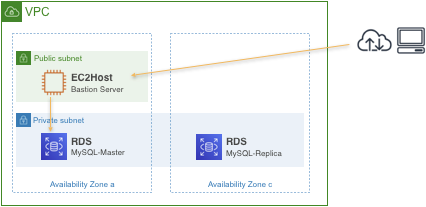

## 4. 실습 요약

1. 읽기 복제본 생성하기
2. 읽기 복제본의 AutoScaling 적용하기

## 5. How to

### 5-1. RDS 읽기 복제본 생성하기

Aurora는 읽기 작업에 대한 부하가 매우 많을 경우 읽기복제본이 병렬적으로 증가 하여 서비스를 유지 할 수 있도록 Auto Scaling 기능을 제공하고 있습니다.

현재 생성 된 RDS Aurora 인스턴스를 확인 해 보면 Master 한 대로 클러스터가 구성이 된 것을 확인 할 수 있습니다.

① [RDS] > [Instances] 로 이동하여 생성 된 Aurora를 확인 및 인스턴스가 생성 된 가용영역을 확인합니다.

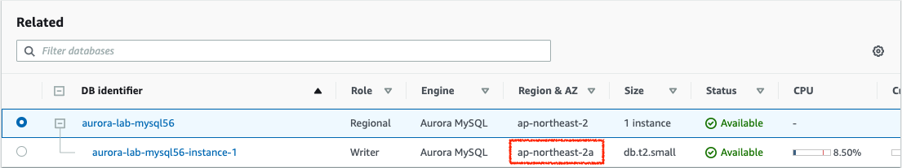

Auto Scaling을 사용하려면 먼저 기본 인스턴스와 적어도 하나의 Aurora 복제본이 있는 Aurora DB 클러스터를 생성해야 합니다. Auto Scaling 기능이 Aurora의 복제본을 관리하더라도 처음에 적어도 하나의 읽기 복제본이 Aurora DB 클러스터에 있어야 합니다.

따라서 읽기 복제본 하나를 먼저 생성 합니다.

② 실습 대상 Aurora Cluster를 선택 후 오른쪽 상단 메뉴에서 [Actions] > [Add reader] 메뉴를 선택

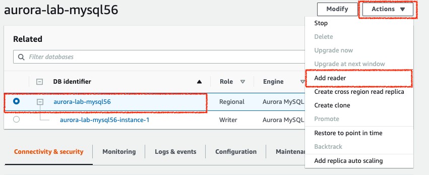

③ 읽기 복제본에 대한 설정값을 아래와 같이 선택합니다.

- Availability Zone : 윗 부분에서 확인 한 Master 인스턴스가 위치한 AZ 와 반대의 AZ를 선택합니다.

  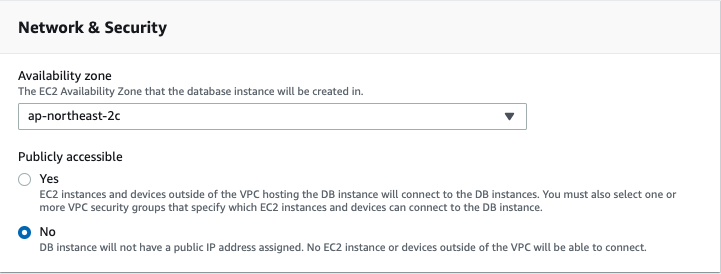

- DB Instance Identifier : 식별 가능한 이름으로 지정합니다 (aurora-lab-mysql56-reader)

  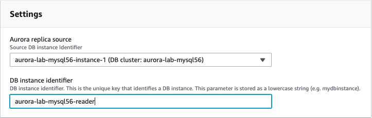

- [Add reader] 를 클릭하여 생성을 완료합니다

### 5-2. RDS AutoScaling 설정하기

읽기 복제본 생성이 완료 되었으면 Auto Scaling 설정을 시작합니다.

④ 실습대상 클러스터를 선택 후 [Actions] > [Add replica autoscaling] 메뉴를 선택

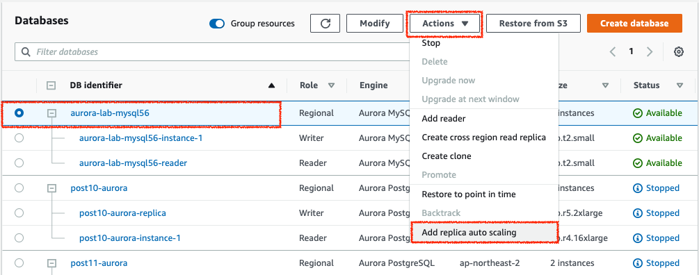

⑤ 읽기 Auto Scaling 설정을 아래와같이 선택합니다

- Policy name : 식별 가능한 이름으로 기재합니다 (aurora-autoscaling-test)
- Target value : 40

  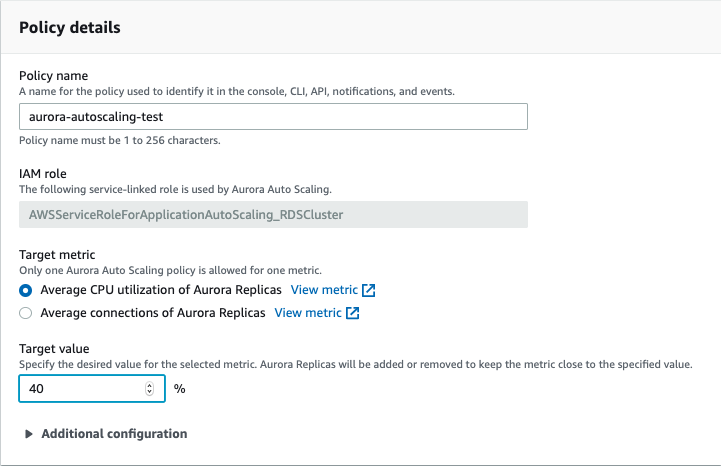

- Minimum capacity : 1
- Maximum capacity : 2

  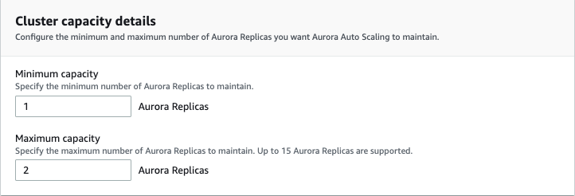

- [Add policy] 버튼을 눌러 설정을 완료합니다.

### 5-3. Auto Scaling 테스트하기

EC2 서버에 SSH 로 접속하여 home 디렉토리에서 진행합니다.

```Bash
wget
```

아래와 같이 python 스크립트를 작성합니다.

```Bash
vi loadtest.py
```

```Python
import mysql.connector
import socket
import time
import thread
import random
import threading
import sys

# Global Variables
start_time = time.time()
query_count = 0
lock = threading.Lock()

def thread_func(host_endpoint, username, password, schema, max_id):
    # Specify that query_count is a global variable
    global query_count

    # Loop Indefinitely
    while True:
        try:
            # Resolve the endpoint
            host_name = socket.gethostbyname(host_endpoint)

            # Generate a random number to use as the lookup value
            key_value = str(random.randrange(1, max_id))

            # Create the SQL query to execute
            sql_command = "select * from sbtest1 where id={0};".format(key_value)

            # Connect to the reader endpoint
            conn = mysql.connector.connect(host=host_name, user=username, passwd=password, database=schema, autocommit=True)

            # Execute query
            conn.cmd_query(sql_command)

            # Close the connection
            conn.close()

            # Increment the executed query count
            with lock:
                query_count += 1
        except:
            # Display any exception information
            print(sys.exc_info()[1])


def progress():
    # Loop indefinitely
    while True:
        # Format an output string
        output = "{0}\r".format(int(query_count / (time.time()-start_time)))

        # Write to STDOUT and flush
        sys.stdout.write(output)
        sys.stdout.flush()

        # Sleep this thread for 1 second
        time.sleep(1)

# Entry Point
host_endpoint = sys.argv[1]
username = 'sookim'
password = 'zmffkdnemxla1!'
schema = 'aurora_test'
max_id = 2500000
thread_count = 25

# Start progress thread
thread.start_new_thread(progress, ())

# Start readers
for thread_id in range(thread_count):
        thread.start_new_thread(thread_func, (host_endpoint, username, password, schema, max_id,))

# Loop indefinitely to prevent application exit
while 1:
        pass
```

위 스크립트를 작성 할 때, 데이터베이스 접속정보를 꼭 확인하고 변경 해 주세요

아래 명령어로 작성 된 스크립트를 저장하고 빠져나옵니다.

```vi
:wq!
```

설정 하기 전, RDS Aurora 설정을 확인하여 Read-only Endpoint를 기록 해 둡니다

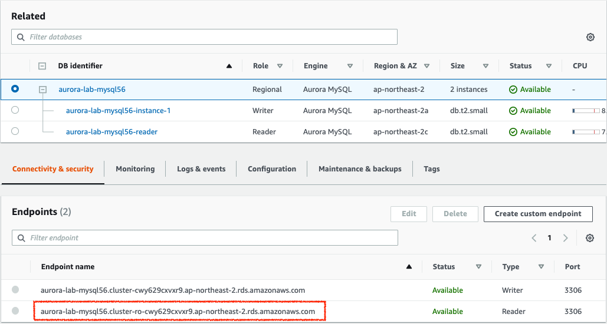

현 위치에서 아래와 같이 python 스크립트를 실행시켜 RDS 읽기 복제본으로 부하를 줍니다.

```Bash
python loadtest.py <rds_endpoint>
```
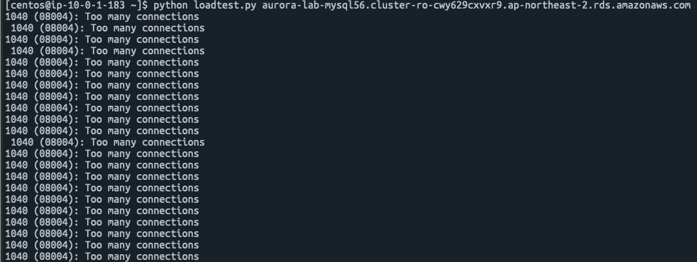

② 웹콘솔로 가서 읽기 복제본에 부하가 얼마나 가는지 확인합니다.

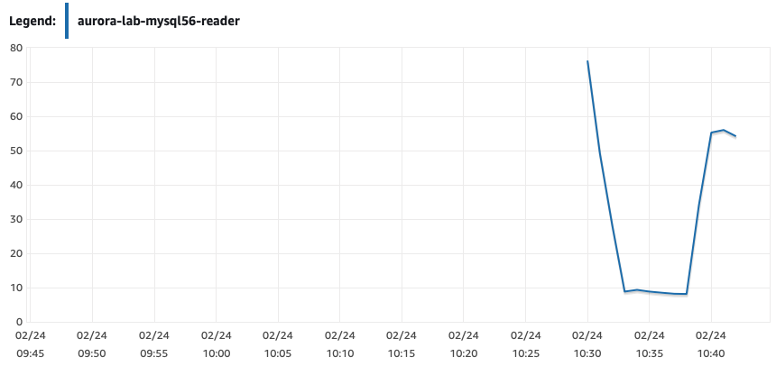

③ CPU 사용률 50%가 넘은 후로 읽기 복제본이 추가되었는지 확인합니다.

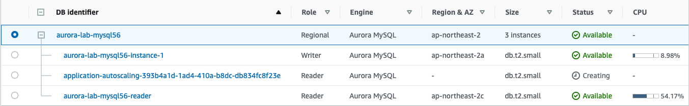

④ 테스트가 완료되었으면 SSH 창에서 Ctr+C 를 눌러 파이썬 스크립트를 종료합니다. 종료하지 않으면 부하가 계속 가기 때문에 멈춰주세요
Auto Scaling으로 추가 된 RDS 인스턴스는 스크립트 종료 후에 CPU 수치가 안정되면 자동으로 terminate 됩니다.
