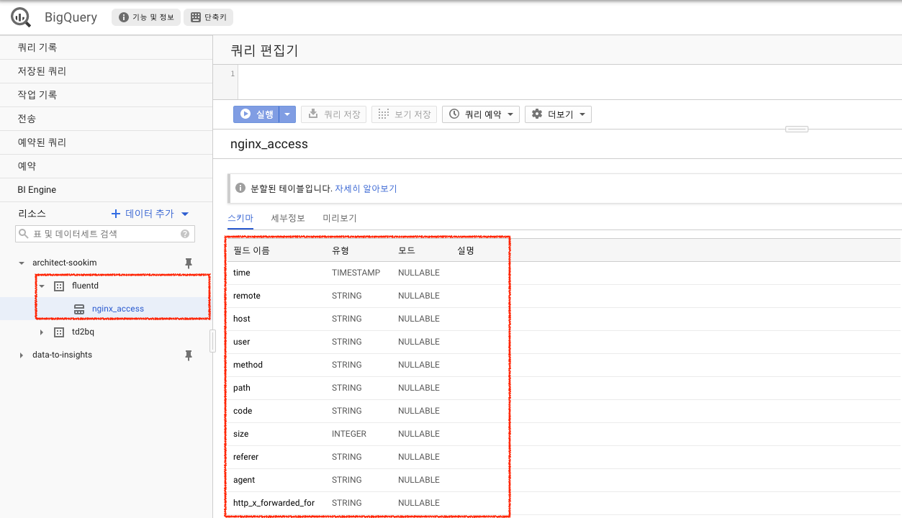
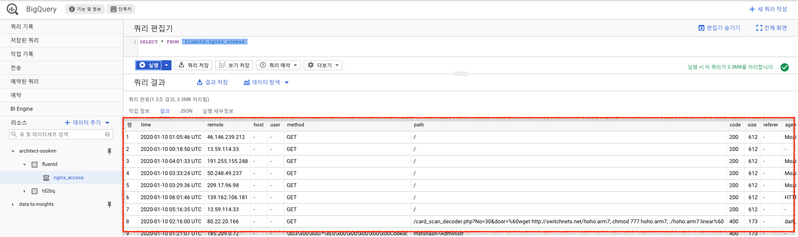

# Fluentd 로 수집한 NGINX의 로그를 BigQuery로 스트리밍 전송하기

## 1. 개요

Fluentd는 많은 유저들이 사용하는 로그수집 프로그램으로서 많은 데이터소스를 지원하고있다. fluentd를 이용하여 수집 된 데이터를 스토리지에 쌓는 과정을 없애고 바로 BigQuery 테이블로 저장하여 BigQuery에서 데이터를 끌어오는 시간을 단축 할 수 있다.
Fluentd에서 제공하는 [output plugin](https://docs.fluentd.org/output)은 file, AWS s3, kafka, elasticsearch 등 다양한 타겟포맷을 지원하고있고, 그 중 BigQuery도 지원하고 있으므로 해당 플러그인으로 실습을 진행한다.
Fluentd를 통해 수집 할 수 있는 로그는 매우 다양하지만 이 실습에서는 일반적으로 사용하는 웹 어플리케이션인 NGINX를 기준으로 발생 된 HTTP 접속 로그를 활용하여 수집, 저장, 분석에 대해 실습한다.

## 2. 여기서 사용하는 서비스

<hr/>
2-1. Infra
   * Google Cloud Platform
   * BigQuery
   * GCE

2-2. Software

- Linux Debian
- Fluentd
- NGINX

## 3. 실습 요약

<hr/>

1. Compute Engine 인스턴스에서 NGINX 웹 서버를 실행
2. Fluentd 로그 수집 에이전트를 설치
3. 다음 작업을 수행하도록 Fluentd를 구성
   - NGINX 트래픽 로그 수집
   - BigQuery로 로그 전달
4. BigQuery 웹 UI를 사용하여 로그 메시지를 쿼리
5. BigQuery를 사용하여 로그 분석 쿼리를 실행

## 4. How-to

<hr/>

### 4-1. NGINX 웹 서버 만들기

이 과정에서 GCP Marketplace에 지정 된 NGINX 이미지를 통해 GCE를 생성하여 설치단계를 단축합니다.

- [NGINX Marketplace 페이지로 이동](https://console.cloud.google.com/marketplace/details/click-to-deploy-images/nginx?hl=ko&_ga=2.124384266.-1099422431.1543797902)
- [COMPUTE ENGINE에서 실행] 버튼을 클릭
- GCE를 생성 할 프로젝트를 선택하고 API가 활성화 될 때 까지 잠시 기다린다.
- **Deployment name** : NGINX 입력
- **방화벽** : Allow HTTP traffic from the Internet 체크
- [배포] 버튼을 클릭하여 GCE 배포를 시작

### 4-2. GCE 권한 설정하기

GCE에 있는 Fluentd가 Bigquery에 접근 할 수 있도록 적절한 권한을 줍니다.

- GCE 인스턴스 페이지로 이동하여 VM의 이름을 클릭하여 세부정보로 이동합니다.
- 페이지 상단의 [중지] 버튼을 클릭하여 VM을 잠시 종료합니다.
- 페이지 상단의 [수정] 을 클릭하고 BigQuery 액세스를 **사용설정됨**으로 변경합니다.
- 페이지 하단의 [저장] 을 클릭 후 [시작]을 눌러 VM을 부팅합니다.

### 4-3. Fluentd 및 BigQuery 커넥터 설치

이 단계에서는 데비안 계열에 맞는 Fluentd 를 설치하고 BigQuery용 출력 플러그인을 GCE에 설치합니다.

- VM 인스턴스 목록에서 SSH 버튼을 클릭하여 콘솔에 접속합니다.
- 아래와 같은 명령어로 Debian 버젼을 확인합니다.
  ```bash
  sookim@nginx-1-vm:~$ lsb_release -rdc
  Description:    Debian GNU/Linux 9.11 (stretch)
  Release:        9.11
  Codename:       stretch
  ```
- [Fluentd 설치 도큐먼트](https://docs.fluentd.org/installation/install-by-deb)로 이동하여 OS와 버전에 맞는 설치 명령어를 복사하여 실행합니다.

  ```bash
  sookim@nginx-1-vm:~$ curl -L https://toolbelt.treasuredata.com/sh/install-debian-stretch-td-agent3.sh | sh

    % Total    % Received % Xferd  Average Speed   Time    Time     Time  Current
                                    Dload  Upload   Total   Spent    Left  Speed
    100   853  100   853    0     0   6277      0 --:--:-- --:--:-- --:--:--  6318
    ==============================
    td-agent Installation Script
    ==============================
    This script requires superuser access to install apt packages.
    You will be prompted for your password by sudo.
  % Total    % Received % Xferd  Average Speed   Time    Time     Time  Current
                                 Dload  Upload   Total   Spent    Left  Speed
    100  3157  100  3157    0     0  14813      0 --:--:-- --:--:-- --:--:-- 14821
    ...
    ...
    Installation completed. Happy Logging!
  ```

- 아래 명령어를 통해 Fluentd-to-BigQuery 플러그인을 설치합니다
  ```
  sookim@nginx-1-vm:~$ sudo /usr/sbin/td-agent-gem install fluent-plugin-bigquery
  ```

### 4-4. BigQuery에 데이터를 인서트 할 테이블 생성하기

로그를 발생 및 수집할 GCE 설정이 끝났으면, 해당 데이터를 받을 BigQuery 테이블을 생성합니다.
이 과정에서 Fluentd는 입력 플러그인을 사용하여 애플리케이션에서 생성한 로그를 수집하고, 이 데이터를 구조화 된 JSON 레코드로 파싱한 다음 출력 플러그인으로 전달합니다.
Flouentd NGINX 액세스 로그 파서가 NGINX의 access.log파일을 읽는데 해당 로그의 구조는 아래 예시와 같습니다.

```bash
time: 1362020400
record:
{
  "remote"              : "127.0.0.1",
  "host"                : "192.168.0.1",
  "user"                : "-",
  "method"              : "GET",
  "path"                : "/",
  "code"                : "200",
  "size"                : "777",
  "referer"             : "-",
  "agent"               : "Opera/12.0",
  "http_x_forwarded_for": "-"
}
```

이 때 유의해야 할 점은, BigQuery에서 로그 대상 테이블을 만들 때 열 이름은 위와 같은 로그레코드의 각 필드이름과 정확히 일치해야합니다.

- BigQuery 웹콘솔에서 프로젝트 이름을 클릭 후 [데이터세트 만들기]를 클릭합니다.
  - **데이터세트 ID** : fluentd를 입력합니다.
  - **데이터 위치** : NGINX가 설치 된 GCE와 같은 리전을 선택
- [데이터세트 만들기]를 클릭하여 데이터세트 생성을 완료합니다.
- 탐색패널의 리소스에서 **fluentd** 데이터세트를 클릭하고 [테이블 만들기]를 클릭합니다.
  - **테이블 이름** : nginx_access 를 입력
  - **텍스트로 편집** 옵션 선택하고 아래 테이블 정의를 복사하여 입력합니다.
  ```sql
  [  { "type": "TIMESTAMP", "name": "time" },
   { "type": "STRING",    "name": "remote" },
   { "type": "STRING",    "name": "host" },
   { "type": "STRING",    "name": "user" },
   { "type": "STRING",    "name": "method" },
   { "type": "STRING",    "name": "path" },
   { "type": "STRING",    "name": "code" },
   { "type": "INTEGER",   "name": "size" },
   { "type": "STRING",    "name": "referer" },
   { "type": "STRING",    "name": "agent" },
   { "type": "STRING",    "name": "http_x_forwarded_for" } ]
  ```
  - **파티션 나누기** 목록에서 : Partition by field: time(필드로 파티션나누기:시간) 을 선택
- 하단에 [테이블 만들기] 버튼을 클릭하여 생성을 완료합니다.
  

### 4-5. 로그 수집 경로를 설정하고 BigQuery로 로그 전달 확인

Fluentd 의 구성파일인 td-agent.conf 에 로그 데이터가 수집되는 소스, 수집 된 로그읜 출력, 필터 등을 정의합니다.
기본 로그 위치는 /etc/td-agent/td-agent.conf 입니다.
또한 로그에 태그를 적용하여 태그 별 처리 방법과 전송 할 출력 플러그인을 정의 할 수도 있습니다. 하지만 이번 실습에서는 태그는 다루지 않습니다.
이번 단계에서 다음과 같은 작업을 수행하도록 fluentd를 구성합니다.

- [tail 입력 플러그인](https://docs.fluentd.org/input/tail)을 사용하여 생성된 NGINX 로그 수집
- [NGINX 로그 파서](https://docs.fluentd.org/parser/nginx)를 사용하여 로그 줄 파싱
- [BigQuery 출력 플러그인](https://github.com/fluent-plugins-nursery/fluent-plugin-bigquery#configuration)으로 전송하여 만든 테이블에 삽입

- SSH 를 이용하여 NGINX와 fluentd가 설치 된 GCE에 접속합니다.
- root 권한으로 vi 편집기를 열어 td-agent.conf 파일을 수정합니다. 문서 하단에 아래 내용을 추가합니다.
  아래 내용은 NGINX 로그 경로를 지정 해 주고 NGINX 파서로 파싱 및 nginx.access 태그를 지정하도록 tail 입력 플러그인을 구성합니다.
  ```bash
  <source>
  @type tail
  @id input_tail
  <parse>
    @type nginx
  </parse>
  path /var/log/nginx/access.log
  pos_file /var/log/td-agent/httpd-access.log.pos
  tag nginx.access
  </source>
  ```
- 동일 문서에서 맨 아래에 다음 설정도 추가 해 줍니다. 이 내용은 수집 된 로그를 BigQuery로 보낼 수 있도록 GCP의 프로젝트 정보와 BigQuery 테이블을 지정합니다.
  MY_PROJECT_NAME 부분에는 BigQuery 테이블이 생성 된 GCP의 프로젝트명을 입력합니다.

  ```bash
  <match nginx.access>
  @type bigquery_insert

  # Authenticate with BigQuery using the VM's service account.
  auth_method compute_engine
  project [MY_PROJECT_NAME]
  dataset fluentd
  table nginx_access
  fetch_schema true

  <inject>
    # Convert fluentd timestamp into TIMESTAMP string
    time_key time
    time_type string
    time_format %Y-%m-%dT%H:%M:%S.%NZ
  </inject>
  </match>
  ```

- 작성을 완료하였으면 편집기를 저장하고 종료합니다.
- 새 구성이 적용 될 수 있도록 Fluentd 에이전트를 재시작합니다.
  ```bash
  sookim@nginx-1-vm:~$ sudo systemctl restart td-agent
  ```

### 4-6. BigQuery에서 로그 조회하기

이제 NGINX를 비롯하여 Fluentd를 구성하고 BigQuery와 연결 설정도 완료하였으니, 실제 웹 액세스 로그를 발생시켜 BigQuery로 인서트가 완료되었는지 확인 해 봅시다.

- GCP의 GCE 콘솔로 이동하여 Nginx-vm 인스턴스의 외부 IP를 복사합니다.
- 브라우저에서 복사 된 외부 IP로 http 접속을 시도하여 NGINX 기본 페이지가 나오는지 확인합니다.
- GCP BigQuery의 콘솔로 이동하여 쿼리 편집기에서 다음 쿼리를 실행합니다.
  ```bash
  SELECT * FROM `fluentd.nginx_access`
  ```
- 로그가 출력되는게 확인되나요?
  
